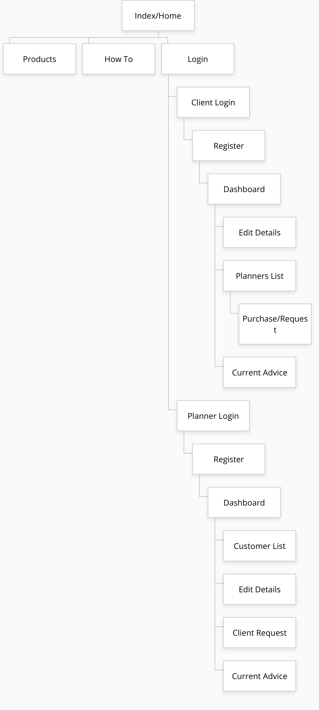
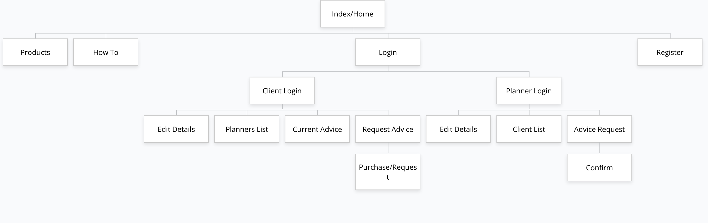
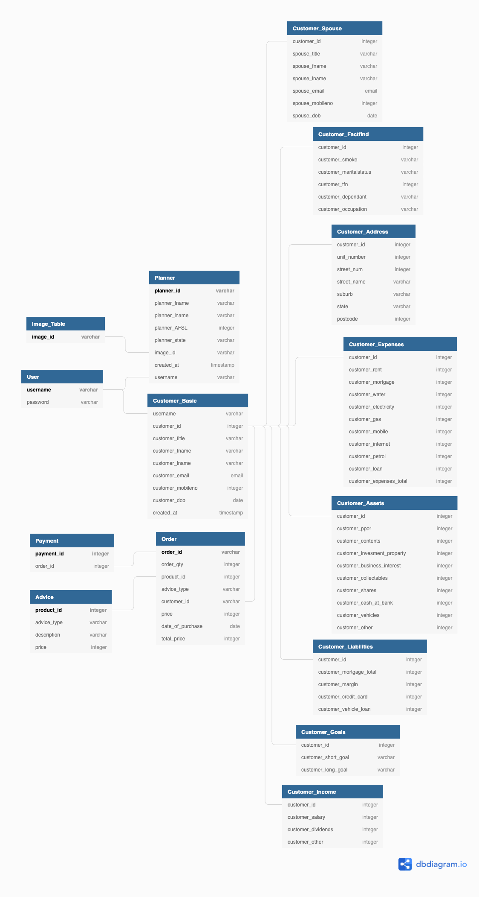

# Coder Academy - Ruby on Rails Marketplace Application

<div style="text-align:center">

  </div>

<p align="center">
  <h2 align="center">Assignment 2 - Term 2 (T2A2)</h2>
  <p align="center">
    <a href="https://github.com/benaitcheson/">View My GitHub</a>
    ·
    <a href="https://github.com/benaitcheson/T2A2_Marketplace_App/">Link to Repository</a>
    ·
    <a href="https://t2a2-marketplace-app.herokuapp.com/">Link to Website</a>
  </p>
</p>

---

## Table of Contents

<!-- TOC depthFrom:1 depthTo:4 withLinks:1 orderedList:0 -->
- [Coder Academy - Ruby on Rails Marketplace Application](#coder-academy---ruby-on-rails-marketplace-application)
  - [Table of Contents](#table-of-contents)
  - [About the Project](#about-the-project)
    - [**Admin Credentials**](#admin-credentials)
    - [**Built With (Tech Stack)**](#built-with-tech-stack)
    - [**Statement of Purpose**](#statement-of-purpose)
    - [**Sitemap**](#sitemap)
    - [**Wireframes**](#wireframes)
    - [**Project Management**](#project-management)
    - [**Target Audience**](#target-audience)
    - [**User Stories**](#user-stories)
      - [As a Guest](#as-a-guest)
      - [As a Planner](#as-a-planner)
      - [As a Client](#as-a-client)
      - [Authentication](#authentication)
    - [**Entity Relationship Diagram (ERD)**](#entity-relationship-diagram-erd)
    - [**Database Schema Design**](#database-schema-design)
    - [**High-Level Components**](#high-level-components)
      - [Model-View-Controller (MVC)](#model-view-controller-mvc)
      - [ActiveRecord](#activerecord)
    - [**Third Party Apps/Services**](#third-party-appsservices)
    - [**Explain the Rails Models**](#explain-the-rails-models)
      - [Admin](#admin)
      - [Clients](#clients)
      - [Client Assets](#client-assets)
      - [Client Liabilities](#client-liabilities)
      - [Client Address](#client-address)
      - [Client Income](#client-income)
      - [Client Goals](#client-goals)
      - [Planners](#planners)
      - [Orders](#orders)
    - [**Rails Controller**](#rails-controller)
  - [Roadmap](#roadmap)
  - [Contributing](#contributing)
  - [Authors](#authors)
  - [Acknowledgments](#acknowledgments)

<!-- /TOC -->

## About the Project

This application was designed to make financial planning costs more competitive so the customer has better access to professional financial advice. Each planner registers their Australian Financial Services Licence (AFSL) and their background while each customer registers and completes the fact finder so that a planner can tailor their advice to each client. Paired with online advice this can give sound financial advice to younger investors at a cheaper rate.

### **Admin Credentials**

Before you use the app it's possible to play around as an admin for both the customer and the planner. Here are the credentials to login in:
- login: `admin@admin.com`
- password: `password1`

### **Built With (Tech Stack)**

The core programming languages used to build this application are:
- Ruby (3.0.1) on Rails (6.1.4)
- HTML5
- CSS3/SCSS
- JavaScript (ES6)
- Postgresql 13.3

These are stored within a public repository on GitHub, because this application has back-end components GitHub pages was inadequate. Heroku was used instead to host the application. Gems and third party software can be viewed [here](#third-party-appsservices).

### **Statement of Purpose**

Research has uncovered the cost of financial advice and it has shown that for those with a lot the cost of advice is small but for those with a little (generally younger clients) the cost is a significant amount. With most Statements of Advice (SoA) in Australia starting at $1,500.00 this is 10% if your net worth is $15,000.

Younger people generally forego advice because they have time on their side. For example, make a crypto investment mistake and you have 40 years worth of working to get that bad investment back. With cheaper advice early on, younger investors can have a more stable path that could see them retire early.

Find-A-Planner can help put Advisors side by side in competition to lower their rates for younger investors. This is a great alternative to help reduce costs for Advisors giving online advice to young investors who don't need complex advice.

### **Sitemap**

Initially this is what I wanted to create for the Find-A-Planner application:



Sitemap created with [Gloomaps](www.gloomaps.com).

Each person whether a planner or a customer has a different login screen. They then put in the appropriate details and land on a dashboard. Customers can see all the different planners from the advice type they selected. While the planners can see some customer information but no private customer details in their dashboard. This protects customer privacy. In this dashboard both parties can edit their details and view their current advice orders.

This is how it ended up:



Both planners and clients come through a login screen and are then redirected to their dashboard page where they can change details and view the list of requests.

### **Wireframes**

This application follow the mobile first approach. The wireframes will consist of a mobile version then a desktop version. All other formats have been included in the road map but unfortunately do not have a timeframe for completion.

Home Page Desktop and Mobile:


How To Page Desktop and Mobile:


Products Page Desktop and Mobile:


Login and Register Page Mobile:


About Us Page Desktop and Mobile:


Fact Finder Desktop and Mobile:


Orders Page Desktop and Mobile:


### **Project Management**

Jira was initially set up to learn how ticketing works but was later removed due to the lack of requirement along side Trello for a team of one.

Trello was the main source of management for this application. The initial steps were all put into Trello to give an overview of requirements from the start. Here is a [link](https://trello.com/b/UWs8TN6Q/marketplaceapp) to where it is currently at. 

Trello was first created off a template and then populated with cards based off the marking rubric for the assignment. Here is the first Trello board:


The Readme file has the most tasks, so was put into one card.


After completed a lot of the tasks you can see how keeping on top of tasks is easy with Trello. I the future I would like to be more specific with the cards created and make them more manageable.


### **Target Audience**

The target audience for this application are people aged below 35 or someone with assets under $100,000. Anyone who has been to a financial planner and has been turned away or anyone who is wanting to compare the price of advice side by side. People who are comfortable to put their details into the application knowing the security will keep their information safe.

### **User Stories**

#### As a Guest
> As a guest, 
> 
> I can view financial planners in certain areas and what sorts of advice they provide, 
> 
> so I can easily go to them for the advice I require.

#### As a Planner
> As a planner, 
> 
> I can have all my clients come to me from one place, 
> 
> with their fact finder already filled out and ready to go, this will save me a lot of time and money.

#### As a Client
> As a customer of Find-A-Planner, 
> 
> I can compare financial planners against each other, 
> 
> so that I can get cheaper advice.

#### Authentication
> As a user of Find-A-Planner, 
> 
> I can have my information protected through authentication,
> 
> this allows me to use the application without worry from threats.

### **Entity Relationship Diagram (ERD)**

The database uses a first normal form database design. This works well to help with privacy for each client as this application allows planner to view each customer when a customer has requested advice but the clients personal information stays hidden until request for advice is approved.

I believe this database managed to achieve Second Normal Form (2NF). This is evident as the client data is separated out into a use for each table. Those are Client address, assets, liabilities, goals, income. To achieve third normal form (3NF) the database could separate out the address to have postcode and state as separate. Along with the client title or planner title.

Here's how the ERD started:


There wasn't much change to the ERD just relationships between the tables were amended to show one to one and one to many.

Here's the final database design:




### **Database Schema Design**

Initially designing the schema and ERD together was made easy with DB Diagram. By creating a visual representation of the database coding the schema was required.

Here's the initial database schema design from DB Diagram:

```
Project Find_A_Planner {
  database_type: 'PostgreSQL'
  Note: 'Connecting clients and planners in one space'
}

Table User {
  username varchar [PK]
  password varchar
}

Ref: User.username - Customer_Basic.username
Ref: User.username - Planner.username

Table Customer_Basic {
  username varchar
  customer_id integer [increment]
  customer_title varchar
  customer_fname varchar
  customer_lname varchar
  customer_email email
  customer_mobileno integer
  customer_dob date
  created_at timestamp
}

Ref: Customer_Basic.customer_id < Order.customer_id
Ref: Customer_Basic.customer_id - Customer_Factfind.customer_id
Ref: Customer_Basic.customer_id - Customer_Address.customer_id
Ref: Customer_Basic.customer_id - Customer_Expenses.customer_id
Ref: Customer_Basic.customer_id - Customer_Assets.customer_id
Ref: Customer_Basic.customer_id - Customer_Spouse.customer_id
Ref: Customer_Basic.customer_id - Customer_Income.customer_id
Ref: Customer_Basic.customer_id - Customer_Goals.customer_id
Ref: Customer_Basic.customer_id - Customer_Liabilities.customer_id

Table Customer_Spouse {
  customer_id integer
  spouse_title varchar
  spouse_fname varchar
  spouse_lname varchar
  spouse_email email
  spouse_mobileno integer
  spouse_dob date
}

Table Customer_Address {
  customer_id integer
  unit_number integer
  street_num integer //must enter
  street_name varchar //must enter
  suburb varchar //must enter
  state varchar //must enter
  postcode integer //must enter
}

Table Customer_Factfind {
  customer_id integer
  customer_smoke varchar
  customer_maritalstatus varchar
  customer_tfn integer
  customer_dependant varchar
  customer_occupation varchar
}

Table Customer_Income {
  customer_id integer
  customer_salary integer
  customer_dividends integer
  customer_other integer
}

Table Customer_Assets {
  customer_id integer
  customer_ppor integer
  customer_contents integer
  customer_invesment_property integer
  customer_business_interest integer
  customer_collectables integer
  customer_shares integer
  customer_cash_at_bank integer
  customer_vehicles integer
  customer_other integer
}

Table Customer_Liabilities {
  customer_id integer
  customer_mortgage_total integer
  customer_margin integer
  customer_credit_card integer
  customer_vehicle_loan integer
}

Table Customer_Expenses {
  customer_id integer
  customer_rent integer
  customer_mortgage integer
  customer_water integer
  customer_electricity integer
  customer_gas integer
  customer_mobile integer
  customer_internet integer
  customer_petrol integer
  customer_loan integer
  customer_expenses_total integer
}

Table Customer_Goals {
  customer_id integer
  customer_short_goal varchar
  customer_long_goal varchar
}

Table Planner {
  planner_id varchar [primary key, unique, increment]
  planner_fname varchar
  planner_lname varchar
  planner_AFSL integer
  planner_state varchar
  image_id varchar
  created_at timestamp
  username varchar
}

Table Image_Table {
  image_id varchar [primary key]
}

Ref: Image_Table.image_id - Planner.image_id

Table Order {
  order_id varchar [primary key]
  order_qty integer
  product_id integer //foreign key
  advice_type varchar
  customer_id varchar
  price integer
  date_of_purchase date
  total_price integer
}

Table Advice {
  product_id integer [primary key]
  advice_type varchar
  description varchar
  price integer
}

Table Payment {
  payment_id integer [primary key]
  order_id integer
}

Ref: Order.order_id - Payment.order_id
ref: Order.product_id - Advice.product_id

```


Here is the copy of the final database schema generated from the db migrations in ruby:

```ruby
  create_table "admins", force: :cascade do |t|
    t.string "email", default: "", null: false
    t.string "encrypted_password", default: "", null: false
    t.string "reset_password_token"
    t.datetime "reset_password_sent_at"
    t.datetime "remember_created_at"
    t.datetime "created_at", precision: 6, null: false
    t.datetime "updated_at", precision: 6, null: false
    t.string "username"
    t.index ["email"], name: "index_admins_on_email", unique: true
    t.index ["reset_password_token"], name: "index_admins_on_reset_password_token", unique: true
  end

  create_table "advicetypes", force: :cascade do |t|
    t.integer "adviceid"
    t.string "type"
    t.datetime "created_at", precision: 6, null: false
    t.datetime "updated_at", precision: 6, null: false
  end

  create_table "client_addresses", force: :cascade do |t|
    t.string "unitnum"
    t.integer "streetnum"
    t.string "streetname"
    t.string "suburb"
    t.string "state"
    t.integer "postcode"
    t.datetime "created_at", precision: 6, null: false
    t.datetime "updated_at", precision: 6, null: false
  end

  create_table "client_assets", force: :cascade do |t|
    t.integer "ppor"
    t.integer "contents"
    t.integer "investproperty"
    t.integer "business"
    t.integer "collectable"
    t.integer "share"
    t.integer "cash"
    t.integer "vehicles"
    t.integer "other"
    t.datetime "created_at", precision: 6, null: false
    t.datetime "updated_at", precision: 6, null: false
  end

  create_table "client_goals", force: :cascade do |t|
    t.string "shortgoal"
    t.string "longgoal"
    t.datetime "created_at", precision: 6, null: false
    t.datetime "updated_at", precision: 6, null: false
  end

  create_table "client_incomes", force: :cascade do |t|
    t.integer "salary"
    t.integer "dividends"
    t.integer "other"
    t.datetime "created_at", precision: 6, null: false
    t.datetime "updated_at", precision: 6, null: false
  end

  create_table "client_liabilities", force: :cascade do |t|
    t.integer "mortgage"
    t.integer "margin"
    t.integer "creditcard"
    t.integer "vehicle"
    t.integer "other"
    t.datetime "created_at", precision: 6, null: false
    t.datetime "updated_at", precision: 6, null: false
  end

  create_table "clients", force: :cascade do |t|
    t.datetime "created_at", precision: 6, null: false
    t.datetime "updated_at", precision: 6, null: false
    t.integer "clientid"
    t.integer "clienttitle"
    t.integer "firstname"
    t.integer "lastname"
    t.integer "email"
    t.integer "mobile"
    t.integer "dateofbirth"
  end

  create_table "orders", force: :cascade do |t|
    t.integer "order_id"
    t.integer "order_qty"
    t.integer "product_id"
    t.integer "customer_id"
    t.integer "total_price"
    t.date "date_of_purchase"
    t.datetime "created_at", precision: 6, null: false
    t.datetime "updated_at", precision: 6, null: false
  end

  create_table "planners", force: :cascade do |t|
    t.integer "afsl"
    t.datetime "created_at", precision: 6, null: false
    t.datetime "updated_at", precision: 6, null: false
    t.string "firstname"
    t.string "lastname"
    t.string "title"
    t.string "plannerid"
  end
```

### **High-Level Components**

#### Model-View-Controller (MVC)

Ruby on Rails uses the Model, View and Controller framework. Each of these is a crucial component for this application. The controller is the centre of all this depending on how many Create, Read, Update and Delete (CRUD) operations you have could determine how many Controllers each application has. Find-A-Planner has two main Controllers, one to hand the CRUD operations for the clients or customers the second controller handles all the planner operations as well as the page navigation and payment methods using Stripe.

The Controller will handle the HTTP request by checking the routes.rb file and if a match is found offers up the appropriate files from the View. Here's an example:

```ruby
get "/admins/sign_in", to: "admin#sign_in", as: :sign_in
```

When a user clicks on the sign in button on the navbar the controller checks the routes for a path to do next. In this case it's a get request and it's just getting the sign in page from the admin views.

#### ActiveRecord

ActiveRecord with Ruby on Rails

### **Third Party Apps/Services**

Here are the third party applications used for Find-A-Planner, in no particular order:

- [Devise](https://github.com/heartcombo/devise): A Ruby gem for creating user authentication. A quick alternative to creating authentication from scratch.
- [Heroku](https://www.heroku.com/): This is a cloud platform that lets the user build, deliver, monitor and scale applications. This means a user can host their full stack application on the internet for free.
- [GitHub](https://github.com/): An online platform for users to store public and private coding projects for free. This platform pairs with Heroku. Github stores the code and Heroku provides the server to fetch the code and send it to the browser.
- [Git](https://git-scm.com/): Version control software that is free. It helps the user keep track of changes allowing them to branch and rollback revisions.
- [Stripe](https://stripe.com/en-au): This is an online company that processes payments for their customers so they don't have to deal with a lot of the legal and finance obligations that come with the transfer of money. They are powerful at collecting money from anyone in any country with minimal processing time. This service is not free.
- [Bootstrap 5](https://getbootstrap.com/): Bootstrap makes putting HTML and CSS together on the web browser simple. By streamlining the code required visually appealing layouts can be
- [Balsamiq](https://balsamiq.com/): This program allows users with little amount of graphic design skills to make mock versions of websites, business cards and other mock ups.
- [Trello](https://trello.com/) / [Jira](https://www.atlassian.com/software/jira): This is a project management tool used to keep track of features and items that need to be done. My Trello board can be viewed [here](https://trello.com/b/UWs8TN6Q/marketplaceapp).
- [Git Guardian](https://www.gitguardian.com/): This program scans the users GitHub account to ensure any passwords or keys aren't made public for someone to scrape and use for malicious activities.
- [DB Diagram.io](https://dbdiagram.io/home): A online platform used to give a visual display of the Entity Relationship Diagram for the back end on Find-A-Planner.
- [Amazon Web Services (S3)](https://aws.amazon.com/s3/): A free cloud storage system. S3 stands for Simple Storage Service. This product offers instant scalability and lots of security. This was chosen over a simple link to images for security and bandwidth.
- [Ultrahook](https://www.ultrahook.com/): An easy to use and free product for testing webhook endpoints in the local environment.
- [Visual Studio Code](https://code.visualstudio.com/): The most popular code editing software with plenty of extensions to help code this application. VS Code is owned by Microsoft and is free to use.
- [Simpleform](https://github.com/heartcombo/simple_form): This gem paired with Bootstrap makes user entry forms simple to setup and create. 
- [Gloomaps](https://www.gloomaps.com/): An online sitemap creation platform. Sitemaps help show an overall picture of how the pages of a website are structured. This can be helpful to quickly find certain parts of a website. This application was easy to use and is free.

### **Explain the Rails Models**

Rails uses models to access data from the database (in this case the postgres database) and hand these to the controller. Common rails mantra is 'fat model, skinny controller', which indicates that the model handles most of the work grabbing and sorting some data to hand over to the controller. Here are the Models used for this project and a short description of their tasks.

#### Admin
This model holds all information regarding the admin level authentication. A user signed in as an admin can see all the client information as well as all the available planners and their advice types.

#### Clients
Clients can't see other clients but can see the list of planners and see the orders they have created. This model has Client_ID which is the primary key for Assets, Liabilities, Address, Income and Goals. These where separate under the first normal form guidelines.

#### Client Assets
Using the Client_ID to link this table. Each client has a single table (a one to one relation) of assets.

#### Client Liabilities
Similar to the Client Assets table the Liabilities table represents a one to one relation to the Client_ID from the Client table. This is a belongs_to for the Client table.

#### Client Address
This another belongs_to from the Client table but this one has sensitive information about the client.

#### Client Income
Each of these was broken up to separate data into a single purpose for each controller. This is another belongs_to from the Client table. The foreign key is the Client_ID, the same as Client_Assets, Client_Liabilities, Client_Address, Client_Income and Client_Goals.

#### Client Goals
This model holds larger text file for each clients short term and long term goals. As per the other models the foreign key (Client_ID) belongs_to the Client model/table and can be viewed by the planner who is preparing advice.

#### Planners
The Planners model can 'has_many' clients but belongs_to the admin model. Each planner can have an image so it will also belong_to an image model.

#### Orders
Finally the Orders model belongs_to the client model. Each order has only one client but each client can have many orders. Similarly each order can only have one payment method and vice versa.

### **Rails Controller**

A Controller was created with a ```rails g controller``` function in the terminal for both the Client and the Planner.

---

## Roadmap

In the future I would like to add some automation to the site. Possibly give some standard advice.

---

## Contributing

Contributions are what make the open source community such an amazing place to be learn, inspire, and create. Any contributions you make are appreciated.

1. Fork the Project
2. Create your Feature Branch (`git checkout -b YourBranchName`)
3. Commit your Changes (`git commit -m 'Add a feature/amendment'`)
4. Push to the Branch (`git push origin YourBranchName`)
5. Open a Pull Request

---

## Authors

Ben Aitcheson - [Github](https://github.com/benaitcheson) / [Website](https://www.benaitcheson.me/)

---

## Acknowledgments

 - Thanks to the team at [Coder Academy](https://www.coderacademy.edu.au/) for their support.

 - Videos from [GoRails](https://gorails.com/) helped a tonne.

 - A page I've followed for a long time always has terrific materials and content, [freeCodeCamp](https://www.freecodecamp.org/).